# 1 项目简介

**题目：** Tlias 智能学习辅助系统

**学生姓名：** 马凌峰    **学号：** 202307020122

**院（系）：** 电子信息与人工智能学院    **专业：** 计算机科学与技术

**指导教师：** 陈景霞

## 1.1 背景及研究现状

### 1.1.1 课题背景
随着信息技术的飞速发展，教育行业正经历着数字化转型的关键时期。传统的线下培训机构和学校在学员管理、教务排课、员工考勤等方面往往依赖人工记录或分散的电子表格，导致数据更新滞后、查询效率低下、信息孤岛现象严重。

在这一背景下，如何利用现代 Web 技术构建一套高效、稳定、易用的智能学习辅助系统（Tlias），实现教务数据的集中化管理与智能化分析，成为提升教育机构管理效率的迫切需求。本系统旨在通过数字化手段，打通学员、班级、教师与教务管理之间的壁垒，为教育决策提供精准的数据支持。

### 1.1.2 研究现状
(1) 教育信息化管理方面
目前，国内外已有许多成熟的教务管理系统（EMS）和学习管理系统（LMS）。国外如 Blackboard、Moodle 等功能强大但部署复杂，且本地化适配成本较高；国内市场则存在大量商业化软件，虽然功能丰富但价格昂贵，且难以满足中小型机构的定制化需求。

(2) 技术架构演进方面
早期的管理系统多采用 JSP 或 ASP.NET 等单体架构，维护困难且耦合度高。近年来，随着前后端分离架构的兴起，"Spring Boot + Vue" 已成为企业级应用开发的主流选择。
**后端**：Java 生态中的 Spring Boot 框架凭借其自动配置和丰富的生态（如 MyBatis, Spring Security），极大地简化了后端开发。
**前端**：Vue.js 及其生态（Vite, Element Plus）以其轻量级、组件化的特点，显著提升了用户界面的交互体验。
**数据存储**：关系型数据库 MySQL 依然是核心业务数据的首选，而对象存储（如阿里云 OSS）则逐渐取代本地文件系统，用于存储图片、文档等非结构化数据。

## 1.2 设计内容与设计思路

### 1.2.1 设计内容
(1) 总体架构设计
**表现层（前端）**：基于 Vue 3 和 Element Plus 构建 SPA（单页应用），负责页面渲染与用户交互。提供登录、员工管理、班级管理、学员管理、报表统计等可视化界面。
**业务逻辑层（后端）**：基于 Spring Boot 框架，提供 RESTful 风格的 API 接口。处理用户认证（JWT）、业务规则校验、事务控制及日志记录（AOP）。
**数据访问层**：利用 MyBatis 框架与 MySQL 数据库交互，实现数据的持久化操作。使用 PageHelper 实现高效的分页查询。

(2) 数据库设计
**数据库选择**：选用 MySQL 8.0 作为主数据库，存储结构化业务数据。
**数据表设计**：
*   `dept`（部门表）：存储部门信息，如名称、描述等。
*   `emp`（员工表）：存储教职工基本信息、职位、薪资等。
*   `emp_expr`（工作经历表）：存储员工的过往履历。
*   `emp_log`（员工日志表）：记录与员工相关的轻量日志（如登录历史、状态变更、备注信息）。
*   `clazz`（班级表）：存储班级名称、教室、开结课时间等。
*   `student`（学员表）：存储学员档案、违纪记录、学历信息。
*   `operate_log`（操作日志表）：记录系统级的操作审计日志（方法名、参数、耗时等）。


### 1.2.2 设计思路
(1) 以用户需求为导向
*   **管理员需求**：提供全维度的管理功能，包括员工入职离职、班级排课、学员档案维护以及全局数据报表，帮助管理员全面掌握机构运行状态。
*   **教师/员工需求**：提供便捷的班级与学员查询功能，支持查看个人工作经历，简化日常教务工作流程。

(2) 数据的可靠性与安全性
*   **身份认证**：采用 JWT（JSON Web Token）令牌机制，实现无状态的身份认证，防止未授权访问。
*   **数据一致性**：在涉及多表操作的业务（如删除员工同时删除其工作经历）中，使用 Spring 的 `@Transactional` 注解确保事务的原子性。
*   **云端存储**：集成阿里云 OSS 服务，将用户头像、学员资料等文件存储在云端，确保数据的安全性和高可用性。

(3) 系统的可扩展性与维护性
*   **模块化设计**：后端按照 Controller、Service、Mapper 分层设计，各层职责单一，便于后续功能的扩展与维护。
*   **统一规范**：定义统一的 API 响应结构（Result）和全局异常处理器，确保前后端交互的标准化。

## 1.3 设计目的及意义

本课题旨在设计并实现一套功能完备的 Tlias 智能学习辅助系统，通过前后端分离的技术架构，解决传统教务管理中信息分散、效率低下的问题。

系统的实现具有以下重要意义：
1.  **提升管理效率**：通过自动化的数据处理和流程管理，大幅降低人工成本，减少数据错误。
2.  **辅助科学决策**：通过可视化的数据报表（如学员学历分布、职位薪资统计），为管理层提供直观的数据支持，辅助制定招生与教学策略。
3.  **技术实践价值**：本项目综合运用了 Java、Spring Boot、MyBatis、Vue 3、MySQL 等主流技术栈，是计算机专业学生将理论知识转化为工程实践的重要载体，有助于提升全栈开发能力和系统设计思维。

# 2 系统分析与设计

## 2.1 可行性分析

### 2.1.1 技术可行性

(1) 后端开发技术
本系统后端采用 Java 17 作为开发语言，基于 Spring Boot 3.5.7 框架构建。Spring Boot 提供了自动配置、起步依赖等特性，极大地简化了企业级应用的开发流程。持久层框架选用 MyBatis 3.0.5，配合 PageHelper 分页插件，能够高效地处理复杂的 SQL 操作和动态查询需求。此外，引入 Lombok 简化代码，使用 JJWT (0.9.1) 实现安全的身份认证，技术栈成熟且稳定，完全满足开发需求。

(2) 前端开发技术
前端采用 Vue 3 + Vite 构建单页应用（SPA），利用 Element Plus 组件库快速搭建美观、统一的用户界面。通过 Axios 与后端进行 RESTful API 通信，实现前后端分离开发。数据可视化方面，集成 ECharts 图表库，能够直观地展示各类统计报表。前端技术栈响应速度快，生态丰富，开发效率高。

(3) 数据存储与处理
系统选用 MySQL 关系型数据库存储核心业务数据（如员工、班级、学员信息），利用其事务机制保证数据的一致性。对于非结构化数据（如用户头像、上传文件），采用阿里云 OSS（对象存储服务）进行云端存储，减轻了本地服务器的存储压力，并提供了高可用性和高并发访问能力。

### 2.1.2 操作可行性

(1) 用户友好性
系统界面基于 Element Plus 设计，遵循主流的 Web 操作习惯，布局清晰，交互逻辑简单。无论是管理员进行复杂的教务管理，还是教师查看班级信息，都能通过直观的菜单和表单快速完成，降低了用户的学习成本。

(2) 集成与部署
后端项目使用 Maven 进行依赖管理和构建，生成的 JAR 包可跨平台运行。前端构建为静态资源后可部署于 Nginx 或嵌入 Spring Boot 中。系统对硬件环境要求较低，常规的云服务器或本地服务器即可满足部署需求，维护方便。

(3) 培训与支持
系统业务流程贴合实际教务场景（如班级管理、学员档案），逻辑自然。配合简明的用户手册或操作指引，用户无需具备深厚的技术背景即可快速上手使用。

## 2.2 需求分析

### 2.2.1 系统设计目标

(1) 全面的信息管理
确保能够高效地对教务核心数据进行管理，包括员工（教职工）的入职、职位调整、工作经历记录；班级的开设、结课管理；以及学员的档案建立、违纪记录和学历信息管理。

(2) 数据完整性与一致性
通过数据库的外键约束和事务控制（@Transactional），确保在进行复杂的业务操作（如删除班级时处理关联学员，删除员工时处理关联经历）时，数据始终保持一致，避免产生孤儿数据。

(3) 安全性与权限控制
实现基于 JWT 令牌的身份认证机制，确保只有合法用户才能访问系统资源。对敏感数据（如密码）进行加密存储，并设计拦截器防止未登录访问，保障系统数据的安全性。

(4) 可视化报表呈现
利用数据可视化技术，对学员分布、员工职位结构、性别比例等数据进行统计分析，并以饼图、柱状图等形式直观展示，为管理层提供决策支持。

(5) 操作审计与追踪
引入 AOP（面向切面编程）技术，自动记录关键业务操作（如增删改）的日志，包括操作人、操作时间、执行方法及耗时，存入 `operate_log` 表，实现操作的可追溯性。

(6) 高效的文件存储
集成阿里云 OSS 服务，提供稳定、快速的文件上传与访问功能，解决传统本地文件存储在扩展性和性能上的瓶颈。

### 2.2.2 系统功能需求分析

(1) 普通用户（教师/员工）功能需求
（a）登录与退出：通过账号密码登录系统，获取相应的操作令牌；使用完毕后安全退出。
（b）个人信息查看：查看个人的基本信息及工作经历。
（c）班级学员查看：查询所带班级的基本信息及班级内学员的详细档案。
（d）报表查询：查看拥有权限范围内的统计报表。

(2) 管理员功能需求
（a）员工管理：录入新员工、编辑员工信息、配置工作经历、重置密码、删除离职员工。
（b）班级管理：创建新班级、分配班主任、设置开结课时间、管理班级状态。
（c）学员管理：录入学员信息、批量导入、违纪处理、学历与学位管理、调整学员班级。
（d）部门管理：维护组织架构，管理各部门信息。
（e）系统日志：查询全系统的操作日志，监控系统运行状态和用户行为。
（f）全局报表：查看全校范围的职位分布、学员统计等综合报表。

### 2.2.3 系统性能需求分析

(1) 数据处理性能
系统应支持分页查询（PageHelper），在面对大量数据（如成千上万条学员记录）时，能够快速响应前端的分页请求，避免全表扫描导致的性能瓶颈。

(2) 数据存储可靠性
MySQL 数据库需配置合理的索引（如在 `username`、`phone` 等字段建立索引），以提高查询效率。同时，OSS 服务保证了文件数据的高可靠性和持久性。

(3) 响应速度
常规业务操作（如列表查询、单条记录增删改）响应时间应控制在 500ms 以内；复杂报表统计应在 1-2 秒内完成。对于耗时的日志记录操作，通过 AOP 异步处理或优化 SQL 写入，确保不阻塞主业务流程。

## 2.3 系统总体设计

### 2.3.1 系统总体结构设计

(1) 系统采用 B/S 架构
系统基于浏览器/服务器（Browser/Server）架构设计。
工作过程如下：
（a）前端交互：用户通过浏览器访问 Vue 前端页面，进行表单填写或数据查询。前端通过 Axios 发送 HTTP 请求（GET/POST/PUT/DELETE）至后端接口。
（b）后端处理：Spring Boot 后端接收请求，Controller 层解析参数，Service 层执行业务逻辑（如计算、校验），Mapper 层通过 MyBatis 执行 SQL 访问 MySQL 数据库。
（c）响应返回：数据库返回结果集，后端将其封装为统一的 JSON 格式（Result 对象），返回给前端进行渲染展示。


(2) 系统采用 MVC 设计模式
（a）基本原理
系统遵循 Model-View-Controller 设计模式，实现关注点分离。
Model（模型）：由 POJO 实体类（如 `Emp`, `Student`）和 Mapper 接口组成，负责数据的承载与持久化操作。
View（视图）：由 Vue 组件构成，负责数据的展示和用户交互，通过 JSON 数据与后端解耦。
Controller（控制器）：如 `EmpController`，负责接收 HTTP 请求，调用 Service 层逻辑，并返回响应数据。
（b）实现方法
后端定义实体类 `Emp` 对应数据库 `emp` 表。Controller 使用 `@RestController` 注解标识，通过 `@Autowired` 注入 Service。Service 层使用 `@Service` 标识，处理事务与业务规则。Mapper 层使用 `@Mapper` 标识，通过 XML 或注解定义 SQL 语句。


(3) Spring Boot 框架技术
（a）总体结构
项目采用标准的 Maven 项目结构，`src/main/java` 存放源代码，`src/main/resources` 存放配置文件（`application.yml`）和 Mapper XML 文件。
（b）依赖管理
通过 `pom.xml` 管理依赖，引入 `spring-boot-starter-web`、`mybatis-spring-boot-starter`、`lombok`、`jjwt` 等核心库。
（c）自动配置
利用 Spring Boot 的自动配置特性，只需在 `application.yml` 中配置数据库连接信息和 OSS 密钥，系统即可自动组装 DataSource 和 SqlSessionFactory。
（d）依赖注入
广泛使用 Spring 的 IOC 容器，通过 `@Autowired` 实现 Controller、Service、Mapper 之间的依赖注入，降低模块耦合度。
（e）启动原理
通过 `TliasWebManagementApplication` 主类的 `@SpringBootApplication` 注解启动应用，内置 Tomcat 服务器自动运行并监听 8080 端口。


### 2.3.2 系统功能模块设计

系统主要划分为以下核心功能模块：
（a）员工管理模块：负责教职工的入职、离职、信息修改及工作经历维护。
（b）部门管理模块：负责组织架构的增删改查。
（c）班级管理模块：负责班级的排课、班主任分配及状态管理。
（d）学员管理模块：负责学员档案管理、违纪处理及学历信息维护。
（e）报表统计模块：提供职位分布、性别比例、学员学历分布等可视化图表。
（f）系统日志模块：记录并查询用户的关键操作日志。
（g）文件服务模块：处理图片、文档的上传与云端存储。


### 2.3.3 主要业务流程

用户登录后，根据角色权限进入相应的主界面。前端发起请求，后端验证 JWT 令牌合法性后处理业务。

（a）用户登录业务流程
用户输入账号密码 -> 后端 `LoginController` 接收 -> 调用 Service 查询数据库 -> 校验密码 -> 若通过生成 JWT 令牌并返回 -> 前端存储令牌。


（b）新增员工业务流程
管理员填写员工信息表单 -> 提交至 `POST /emps` -> 后端校验参数 -> `EmpService` 开启事务 -> 插入 `emp` 表 -> 循环插入 `emp_expr` 表（工作经历） -> 提交事务 -> AOP 记录日志 -> 返回成功。


（c）文件上传业务流程
用户选择文件 -> 前端调用 `POST /upload` -> 后端 `UploadController` 接收 `MultipartFile` -> 调用阿里云 OSS SDK 上传文件 -> 获取 URL -> 返回 URL 给前端回显。


（d）报表查询业务流程
用户进入报表页面 -> 前端发起 `GET /report/*` 请求 -> 后端执行聚合 SQL（`GROUP BY`） -> 返回统计数据 -> 前端 ECharts 渲染图表。


## 2.4 系统数据库设计

### 2.4.1 数据库概念模型设计

本系统主要涉及 **员工(Employee)**、**工作经历(Experience)**、**班级(Class)**、**学员(Student)** 四个核心实体以及系统层面的 **操作日志(OperateLog)**。

实体间关系分析：
1.  **员工与工作经历**：一对多关系（1:N），一名员工可以有多段工作经历。
2.  **员工与班级**：一对多关系（1:N），一名员工（班主任）可以管理多个班级。
3.  **班级与学员**：一对多关系（1:N），一个班级包含多名学员。

**系统 E-R 概念模型图：**


---

### 2.4.2 数据库逻辑结构设计

#### 1. 数据库选型与创建
本系统采用 **MySQL 8.0** 关系型数据库进行设计与开发。
*   **选用原则与理由**：
    *   **成熟稳定**：MySQL 是最流行的开源数据库，社区活跃，技术成熟。
    *   **事务支持**：InnoDB 引擎支持 ACID 事务，确保员工入职、学员档案维护等业务的数据一致性。
    *   **高性能**：在百万级数据量下依然保持良好的读写性能，满足教务管理系统的并发需求。
    *   **兼容性**：与后端 Spring Boot 技术栈结合紧密，开发效率高。

*   **数据库创建过程**：
    ```sql
    CREATE DATABASE IF NOT EXISTS tlias DEFAULT CHARSET utf8mb4 COLLATE utf8mb4_unicode_ci;
    USE tlias;
    ```

#### 2. 数据表逻辑结构
以下是核心数据表的详细结构设计：

**表1：emp (员工信息表)**
| Column Name | Data Type    | Width | 空值情况 | 描述/备注              |
| :---------- | :----------- | :---- | :------- | :--------------------- |
| id          | INT UNSIGNED | 11    | **主键** | 自增 ID                |
| username    | VARCHAR      | 20    | 不为空   | 用户名 (Unique)        |
| password    | VARCHAR      | 50    | 可为空   | 密码 (默认123456)      |
| name        | VARCHAR      | 10    | 不为空   | 真实姓名               |
| gender      | TINYINT      | 1     | 不为空   | 1:男, 2:女             |
| phone       | CHAR         | 11    | 不为空   | 手机号 (Unique)        |
| job         | TINYINT      | 1     | 可为空   | 职位: 1班主任, 2讲师等 |
| salary      | INT UNSIGNED | 11    | 可为空   | 薪资                   |
| image       | VARCHAR      | 300   | 可为空   | 头像 URL               |
| entry_date  | DATE         | -     | 可为空   | 入职日期               |
| dept_id     | INT UNSIGNED | 11    | 可为空   | 归属部门 ID            |
| create_time | DATETIME     | -     | 可为空   | 创建时间               |
| update_time | DATETIME     | -     | 可为空   | 修改时间               |

**表2：emp_expr (员工工作经历表)**
| Column Name | Data Type    | Width | 空值情况 | 描述/备注     |
| :---------- | :----------- | :---- | :------- | :------------ |
| id          | INT UNSIGNED | 11    | **主键** | 自增 ID       |
| emp_id      | INT UNSIGNED | 11    | 可为空   | 关联员工表 ID |
| begin       | DATE         | -     | 可为空   | 开始时间      |
| end         | DATE         | -     | 可为空   | 结束时间      |
| company     | VARCHAR      | 50    | 可为空   | 公司名称      |
| job         | VARCHAR      | 50    | 可为空   | 职位名称      |

**表3：clazz (班级信息表)**
| Column Name | Data Type    | Width | 空值情况 | 描述/备注              |
| :---------- | :----------- | :---- | :------- | :--------------------- |
| id          | INT UNSIGNED | 11    | **主键** | 自增 ID                |
| name        | VARCHAR      | 30    | 不为空   | 班级名称 (Unique)      |
| room        | VARCHAR      | 20    | 可为空   | 教室编号               |
| begin_date  | DATE         | -     | 不为空   | 开课时间               |
| end_date    | DATE         | -     | 不为空   | 结课时间               |
| master_id   | INT UNSIGNED | 11    | 可为空   | 班主任 ID (关联 emp)   |
| subject     | TINYINT      | 1     | 不为空   | 学科: 1 Java, 2 前端等 |
| create_time | DATETIME     | -     | 可为空   | 创建时间               |
| update_time | DATETIME     | -     | 可为空   | 修改时间               |

**表4：student (学员信息表)**
| Column Name | Data Type    | Width | 空值情况 | 描述/备注         |
| :---------- | :----------- | :---- | :------- | :---------------- |
| id          | INT UNSIGNED | 11    | **主键** | 自增 ID           |
| name        | VARCHAR      | 10    | 不为空   | 学员姓名          |
| no          | CHAR         | 10    | 不为空   | 学号 (Unique)     |
| gender      | TINYINT      | 1     | 不为空   | 1:男, 2:女        |
| phone       | VARCHAR      | 11    | 不为空   | 手机号 (Unique)   |
| id_card     | CHAR         | 18    | 不为空   | 身份证号 (Unique) |
| is_college  | TINYINT      | 1     | 不为空   | 1:院校, 0:非院校  |
| address     | VARCHAR      | 100   | 可为空   | 联系地址          |
| degree      | TINYINT      | 1     | 可为空   | 学历: 1初中-6博士 |
| clazz_id    | INT UNSIGNED | 11    | 不为空   | 所属班级 ID       |
| create_time | DATETIME     | -     | 可为空   | 创建时间          |

**表5：operate_log (系统操作日志表)**
| Column Name    | Data Type    | Width | 空值情况 | 描述/备注 |
| :------------- | :----------- | :---- | :------- | :-------- |
| id             | INT UNSIGNED | 11    | **主键** | 自增 ID   |
| operate_emp_id | INT UNSIGNED | 11    | 可为空   | 操作人 ID |
| operate_time   | DATETIME     | -     | 可为空   | 操作时间  |
| class_name     | VARCHAR      | 100   | 可为空   | 类名      |
| method_name    | VARCHAR      | 100   | 可为空   | 方法名    |
| cost_time      | INT          | 11    | 可为空   | 耗时(ms)  |

---

### 2.4.3 数据库关系设计

系统各表之间的物理外键及逻辑关联关系如下图所示：


**关系说明：**
1.  **emp -> emp_expr**: 通过 `emp_id` 建立物理外键关联，删除员工时通常需级联删除经历。
2.  **emp -> clazz**: 通过 `master_id` 关联，`emp` 表中的员工作为 `clazz` 表的班主任。
3.  **clazz -> student**: 通过 `clazz_id` 关联，表示学员归属的班级。
4.  **emp -> operate_log**: 逻辑关联，记录哪位员工（`operate_emp_id`）执行了系统操作。

# 3 系统详细设计

## 3.1 系统开发及运行环境

### 3.1.1 软件环境
系统基于 Windows 10/11 操作系统开发，使用 IntelliJ IDEA 作为集成开发环境。
*   **前端**：采用 Vue 3 + Vite 构建，使用 Visual Studio Code 进行开发。依赖 Node.js (v16+) 环境。
*   **后端**：基于 Spring Boot 3.5.7 框架，使用 JDK 17 进行编译与运行。
*   **数据库**：MySQL 8.0，使用 Navicat 或 MySQL Workbench 进行管理。
*   **构建工具**：Maven 3.8+ 用于后端依赖管理，NPM 用于前端包管理。

### 3.1.2 硬件环境
*   **客户端**：支持现代 Web 标准的浏览器（Chrome, Edge, Firefox），建议内存 8GB 以上。
*   **服务器端**：建议配置 4 核 CPU，8GB 内存，50GB 以上硬盘空间，以支持 MySQL 数据库与 Java 应用的稳定运行。

# 3.2 系统采用的关键技术

本系统采用当前主流的前后端分离架构进行开发，后端基于Spring Boot框架，前端基于Vue.js框架。在开发过程中，为了提高系统的可维护性、安全性和扩展性，采用了多项关键技术，包括MyBatis持久层框架、JWT令牌认证、AOP面向切面编程、PageHelper分页插件、阿里云OSS对象存储以及全局异常处理机制等。下面将对这些关键技术的原理和具体实现方法进行详细阐述。

### 3.2.1 前后端分离架构与RESTful API设计

系统采用前后端分离的开发模式，前端负责页面展示和用户交互，后端负责业务逻辑处理和数据存储。前后端之间通过HTTP协议进行通信，使用JSON格式交换数据。

**1. 技术原理**
*   **前端**：使用Vue.js框架构建单页面应用（SPA），通过Axios发送异步HTTP请求调用后端接口。
*   **后端**：使用Spring Boot框架构建Web服务，提供RESTful风格的API接口。
*   **交互方式**：前端发送请求 -> 后端处理请求 -> 后端返回JSON数据 -> 前端解析JSON并渲染页面。

**2. 交互流程图**

```mermaid
sequenceDiagram
    %% 1. 全局配置
    %%{init: { 
        'theme': 'base', 
        'themeVariables': { 
            'primaryColor': '#e6f7ff',
            'primaryTextColor': '#000000',
            'primaryBorderColor': '#1890ff',
            'lineColor': '#5c6b77',
            'secondaryColor': '#f9f0ff',
            'tertiaryColor': '#fffbe6',
            'activationBkgColor': '#fff0f6' 
        }
    }}%%

    autonumber

    %% 2. 区域分组：修复了颜色定义，使用 Hex 代码
    %% #f0f5ff 对应之前的淡蓝色
    box #f0f5ff "客户端 (Client Side)"
        actor User as 用户
        participant Frontend as 前端(Vue.js)
    end

    %% #fff7e6 对应之前的淡橙色
    box #fff7e6 "服务端 (Server Side)"
        participant Backend as 后端(Spring Boot)
        participant DB as 数据库(MySQL)
    end

    %% 3. 交互流程
    User->>Frontend: 1. 点击“查询员工”按钮
    activate Frontend
    
    note right of User: 触发页面交互事件
    
    Frontend->>Backend: 2. 发送 Ajax 请求 (GET /emps)
    activate Backend
    
    %% 添加鉴权逻辑备注
    note right of Frontend: Header携带: Authorization(JWT)
    
    Backend->>Backend: 3. Interceptor 拦截鉴权
    
    Backend->>DB: 4. 执行 SQL 查询
    activate DB
    note right of DB: select * from emp <br/>where name like ?
    
    DB-->>Backend: 5. 返回结果集 (ResultSet)
    deactivate DB
    
    Backend-->>Frontend: 6. 返回 JSON 响应 (Result<PageBean>)
    deactivate Backend
    
    Frontend->>Frontend: 7. 解析数据并渲染表格
    
    Frontend-->>User: 8. 展示员工列表
    deactivate Frontend
```



**3. 优势**
*   **解耦合**：前后端代码解耦，开发人员可以并行开发，互不干扰。
*   **复用性**：后端接口可以被多个前端（Web、App、小程序）复用。
*   **用户体验**：前端采用局部刷新技术，页面响应速度快，用户体验好。

### 3.2.2 MyBatis持久层框架与数据库访问

系统使用MyBatis作为持久层框架，负责Java对象与数据库表之间的映射和交互。MyBatis消除了几乎所有的JDBC代码和参数的手工设置以及结果集的检索。

**1. 技术原理**
*   **Mapper接口**：定义数据访问的方法接口，如 `EmpMapper`。
*   **XML映射文件**：编写SQL语句，配置结果映射，如 `EmpMapper.xml`。
*   **动态SQL**：利用MyBatis提供的 `<if>`, `<where>`, `<foreach>` 等标签，根据参数动态生成SQL语句，实现灵活的条件查询和批量操作。
*   **连接池**：Spring Boot默认集成HikariCP连接池，高效管理数据库连接资源。

**2. 实现示例**
在 `EmpMapper.xml` 中，使用动态SQL实现多条件组合查询：

```xml
<select id="list" resultType="org.example.pojo.Emp">
    SELECT e.*, d.name AS deptName
    FROM emp e LEFT JOIN dept d ON e.dept_id = d.id
    <where>
        <if test="name != null and name != ''"> AND e.name LIKE CONCAT('%', #{name}, '%') </if>
        <if test="gender != null"> AND e.gender = #{gender} </if>
        <if test="begin != null"> AND e.entry_date &gt;= #{begin} </if>
        <if test="end != null"> AND e.entry_date &lt;= #{end} </if>
    </where>
    ORDER BY e.update_time DESC
</select>
```

### 3.2.3 基于JWT的系统安全控制

为了保证系统的安全性，防止未授权访问，系统采用了JWT（JSON Web Token）技术进行用户身份认证。

**1. 技术原理**
*   **登录认证**：用户登录成功后，服务器生成一个包含用户信息的JWT令牌，并返回给客户端。
*   **令牌存储**：客户端收到令牌后，将其存储在本地（如LocalStorage）。
*   **请求携带**：客户端在后续的每次请求中，都会在HTTP请求头（Header）中携带该令牌。
*   **拦截校验**：后端定义拦截器 `TokenInterceptor`，拦截所有请求（登录接口除外），解析并校验令牌的合法性。如果令牌无效或过期，则拒绝访问并返回401状态码。

**2. 认证流程图**


### 3.2.4 基于AOP的日志管理

系统使用Spring AOP（面向切面编程）技术，实现了操作日志的自动记录功能，能够记录用户的增删改操作，便于后续的审计和追踪。

**1. 技术原理**
*   **自定义注解**：定义 `@LogOperation` 注解，用于标记需要记录日志的方法。
*   **切面类**：定义 `OperationLogAspect` 切面类，使用 `@Around` 环绕通知拦截被 `@LogOperation` 标记的方法。
*   **日志记录**：在目标方法执行前后，获取操作人ID、操作时间、类名、方法名、参数、返回值以及执行耗时等信息，并将其封装为 `OperateLog` 对象，最终保存到数据库中。

**2. 关键代码逻辑**
```java
@Around("@annotation(log)")
public Object around(ProceedingJoinPoint joinPoint, LogOperation log) throws Throwable {
    long startTime = System.currentTimeMillis();
    Object result = joinPoint.proceed(); // 执行目标方法
    long endTime = System.currentTimeMillis();
    
    // 异步或同步记录日志到数据库
    OperateLog operateLog = new OperateLog();
    operateLog.setMethodName(joinPoint.getSignature().getName());
    operateLog.setCostTime(endTime - startTime);
    // ... 设置其他属性
    operateLogMapper.insert(operateLog);
    
    return result;
}
```

### 3.2.5 PageHelper分页显示技术

在处理大量数据展示时，一次性加载所有数据会严重影响系统性能。系统引入了PageHelper分页插件，实现了高效的物理分页。

**1. 技术原理**
*   **拦截器机制**：PageHelper利用MyBatis的拦截器机制，在SQL执行前拦截查询语句。
*   **自动改写SQL**：根据传入的分页参数（页码 `page` 和每页条数 `pageSize`），自动在原SQL语句后追加 `LIMIT` 子句。
*   **结果封装**：执行分页查询后，PageHelper会自动查询总记录数，并将结果封装为 `Page` 对象，包含当前页数据、总记录数、总页数等信息。

**2. 使用方法**
在Service层中，只需一行代码即可开启分页：
```java
PageHelper.startPage(page, pageSize);
List<Emp> list = empMapper.list(param);
PageResult<Emp> pageResult = new PageResult<>(list.getTotal(), list.getResult());
```

### 3.2.6 阿里云OSS对象存储

系统集成了阿里云OSS（Object Storage Service）服务，用于存储员工头像等非结构化数据。相比于本地文件存储，OSS提供了更高的可靠性、安全性和扩展性。

**1. 技术原理**
*   **SDK集成**：引入 `aliyun-sdk-oss` 依赖。
*   **配置管理**：在 `application.yml` 中配置OSS的 `endpoint`、`bucketName`、`accessKeyId` 等参数。
*   **文件上传**：通过 `OSSClient` 的 `putObject` 方法，将文件流上传到指定的Bucket中，并返回文件的访问URL。
*   **文件名处理**：为了防止文件名冲突，上传前使用UUID重命名文件，并按年月划分目录存储。

### 3.2.7 全局异常处理机制

为了规范系统的异常处理，避免将原始的堆栈信息直接暴露给前端，系统实现了全局异常处理机制。

**1. 技术原理**
*   **@RestControllerAdvice**：定义全局异常处理类 `GlobalExceptionHandler`，该类会拦截所有Controller层抛出的异常。
*   **@ExceptionHandler**：在方法上使用该注解，指定处理特定类型的异常（如 `DuplicateKeyException`、`DeptHasEmployeesException` 等）。
*   **统一响应**：捕获异常后，解析异常信息，并将其封装为统一的 `Result` 对象（包含错误码和错误提示信息）返回给前端。

**2. 异常处理表**

| 异常类型                    | 描述                               | 处理策略                     |
| :-------------------------- | :--------------------------------- | :--------------------------- |
| `DuplicateKeyException`     | 数据库唯一约束冲突（如用户名重复） | 提示用户数据已存在           |
| `DeptHasEmployeesException` | 删除包含员工的部门                 | 提示先删除员工再删除部门     |
| `RuntimeException`          | 其他运行时异常                     | 返回异常的具体Message信息    |
| `Exception`                 | 未知系统异常                       | 返回“系统繁忙，请联系管理员” |

## 3.3 系统框架的实现

### 3.3.1 项目总体结构

后端项目采用标准的分层架构：
*   **Controller 层** (`org.example.controller`)：接收 HTTP 请求，解析参数，调用 Service。
*   **Service 层** (`org.example.service`)：定义业务接口与实现类，处理事务与业务逻辑。
*   **Mapper 层** (`org.example.mapper`)：定义数据访问接口，与 XML 映射文件配合。
*   **POJO 层** (`org.example.pojo`)：定义实体类（Entity）与数据传输对象（DTO/VO）。
*   **Utils 层** (`org.example.utils`)：提供通用工具类，如 `JwtUtils`, `AliOSSUtils`。

### 3.3.2 系统主要配置文件

**(1) application.yml**
核心配置文件，配置了数据库连接、MyBatis 行为、文件上传限制及阿里云 OSS 参数。

```yaml
spring:
  datasource:
    driver-class-name: com.mysql.cj.jdbc.Driver
    url: jdbc:mysql://localhost:3306/tlias
    username: root
    password: 1234 # 敏感信息已脱敏
  servlet:
    multipart:
      max-file-size: 10MB
      max-request-size: 100MB

mybatis:
  configuration:
    map-underscore-to-camel-case: true # 开启驼峰命名映射
    log-impl: org.apache.ibatis.logging.stdout.StdOutImpl # 输出 SQL 日志

aliyun:
  oss:
    endpoint: https://oss-cn-hangzhou.aliyuncs.com
    bucketName: web-framework
```

**(2) pom.xml**
Maven 依赖配置文件，声明了项目所需的依赖库。

```xml
<dependencies>
    <!-- Web 开发支持 -->
    <dependency>
        <groupId>org.springframework.boot</groupId>
        <artifactId>spring-boot-starter-web</artifactId>
    </dependency>
    <!-- MyBatis 持久层 -->
    <dependency>
        <groupId>org.mybatis.spring.boot</groupId>
        <artifactId>mybatis-spring-boot-starter</artifactId>
        <version>3.0.5</version>
    </dependency>
    <!-- JWT 令牌 -->
    <dependency>
        <groupId>io.jsonwebtoken</groupId>
        <artifactId>jjwt</artifactId>
        <version>0.9.1</version>
    </dependency>
    <!-- 阿里云 OSS -->
    <dependency>
        <groupId>com.aliyun.oss</groupId>
        <artifactId>aliyun-sdk-oss</artifactId>
        <version>3.15.1</version>
    </dependency>
    <!-- Lombok 工具 -->
    <dependency>
        <groupId>org.projectlombok</groupId>
        <artifactId>lombok</artifactId>
    </dependency>
</dependencies>
```

# 3.4 系统功能模块详细设计

### 3.4.1 员工信息管理

#### 页面列表及功能描述
员工信息管理模块主要用于对企业员工数据进行维护。主要功能包括：
1.  **分页查询**：展示员工列表，支持分页显示。
2.  **条件查询**：支持根据姓名（模糊查询）、性别、入职日期范围进行筛选。
3.  **新增员工**：录入新员工的基本信息及工作经历。
4.  **修改员工**：更新员工信息及工作经历。
5.  **删除员工**：支持单个或批量删除员工及其关联的工作经历。
6.  **文件上传**：支持上传员工头像图片。

#### 表结构设计
员工信息存储在 `emp` 表中，表结构设计如下：

| 字段名      | 类型     | 长度 | 说明     | 约束                                               |
| :---------- | :------- | :--- | :------- | :------------------------------------------------- |
| id          | int      |      | 主键ID   | Primary Key, Auto Increment                        |
| username    | varchar  | 20   | 用户名   | Unique                                             |
| password    | varchar  | 32   | 密码     |                                                    |
| name        | varchar  | 10   | 姓名     | Not Null                                           |
| gender      | tinyint  |      | 性别     | 1:男, 2:女                                         |
| phone       | char     | 11   | 手机号   |                                                    |
| job         | tinyint  |      | 职位     | 1:班主任, 2:讲师, 3:学工主管, 4:教研主管, 5:咨询师 |
| salary      | int      |      | 薪资     |                                                    |
| image       | varchar  | 300  | 头像URL  |                                                    |
| entry_date  | date     |      | 入职日期 |                                                    |
| dept_id     | int      |      | 部门ID   | Foreign Key (关联dept表)                           |
| create_time | datetime |      | 创建时间 |                                                    |
| update_time | datetime |      | 修改时间 |                                                    |

#### POJO模型
`org.example.pojo.Emp` 类是员工数据的Java对象映射。
```java
@Data
public class Emp {
    private Integer id;
    private String username;
    private String password;
    private String name;
    private Integer gender;
    private String phone;
    private Integer job;
    private Integer salary;
    private String image;
    private LocalDate entryDate;
    private Integer deptId;
    private LocalDateTime createTime;
    private LocalDateTime updateTime;
    // 扩展属性
    private String deptName;
    private List<EmpExpr> exprList;
}
```

#### Controller 控制层
`org.example.controller.EmpController` 负责接收前端请求。
*   `page(EmpQueryParam)`: 分页条件查询 (GET)
*   `save(Emp)`: 新增员工 (POST)
*   `delete(List<Integer>)`: 批量删除 (DELETE)
*   `getById(Integer)`: 根据ID查询 (GET)
*   `update(Emp)`: 修改员工 (PUT)

#### Service 业务层和实现类
`org.example.service.impl.EmpServiceImpl` 实现了 `EmpService` 接口。
*   使用 `PageHelper` 实现分页。
*   使用 `@Transactional` 注解管理事务，确保员工基本信息和工作经历同时保存或回滚。
*   调用 `EmpLogService` 记录操作日志。

#### Mapper 接口和映射文件
*   `EmpMapper`: 定义数据库操作接口。
*   `EmpMapper.xml`: 使用动态SQL实现多条件查询和批量删除。

---

### 3.4.2 部门管理

#### 页面列表及功能描述
部门管理模块用于维护企业的组织架构。主要功能包括：
1.  **查询部门**：列表展示所有部门信息。
2.  **新增部门**：添加新的部门。
3.  **修改部门**：更新部门名称。
4.  **删除部门**：删除指定部门（若部门下有员工则禁止删除）。

#### 表结构设计
部门信息存储在 `dept` 表中。

| 字段名      | 类型        | 说明     | 约束                        |
| :---------- | :---------- | :------- | :-------------------------- |
| id          | int         | 主键ID   | Primary Key, Auto Increment |
| name        | varchar(50) | 部门名称 | Not Null, Unique            |
| create_time | datetime    | 创建时间 |                             |
| update_time | datetime    | 修改时间 |                             |

#### POJO模型
`org.example.pojo.Dept` 类。
```java
@Data
public class Dept {
    private Integer id;
    private String name;
    private LocalDateTime createTime;
    private LocalDateTime updateTime;
}
```

#### Controller 控制层
`org.example.controller.DeptController`。
*   `list()`: 查询所有部门 (GET)
*   `add(Dept)`: 新增部门 (POST)
*   `delete(Integer)`: 删除部门 (DELETE)
*   `update(Dept)`: 修改部门 (PUT)

#### Service 业务层和实现类
`org.example.service.impl.DeptServiceImpl`。
*   `deleteById(Integer)`: 删除前会检查该部门下是否存在员工，若存在则抛出异常，阻止删除。

#### Mapper 接口和映射文件
`org.example.mapper.DeptMapper`。
*   使用注解方式（`@Select`, `@Insert`, `@Delete`, `@Update`）实现基本的CRUD操作。

---

### 3.4.3 班级管理

#### 页面列表及功能描述
班级管理模块用于管理教学班级。主要功能包括：
1.  **分页查询**：支持按班级名称、结课时间范围进行筛选。
2.  **新增班级**：录入班级信息，包括开课/结课时间、班主任等。
3.  **修改班级**：更新班级信息。
4.  **删除班级**：删除指定班级。

#### 表结构设计
班级信息存储在 `clazz` 表中。

| 字段名      | 类型     | 说明                 |
| :---------- | :------- | :------------------- |
| id          | int      | 主键ID               |
| name        | varchar  | 班级名称             |
| room        | varchar  | 教室                 |
| begin_date  | date     | 开课时间             |
| end_date    | date     | 结课时间             |
| master_id   | int      | 班主任ID (关联emp表) |
| subject     | tinyint  | 学科                 |
| create_time | datetime | 创建时间             |
| update_time | datetime | 修改时间             |

#### POJO模型
`org.example.pojo.Clazz` 类。
```java
@Data
public class Clazz {
    private Integer id;
    private String name;
    private String room;
    private LocalDate beginDate;
    private LocalDate endDate;
    private Integer masterId;
    private Integer subject;
    // ...
    private String masterName; // 班主任姓名
    private String status; // 班级状态(未开班/已开班/已结课)
}
```

#### Controller 控制层
`org.example.controller.ClazzController`。
*   `findAll(ClazzQueryParam)`: 分页条件查询 (GET)
*   `add(Clazz)`: 新增班级 (POST)
*   `delete(int)`: 删除班级 (DELETE)
*   `update(Clazz)`: 修改班级 (PUT)

#### Service 业务层和实现类
`org.example.service.impl.ClazzServiceImpl`。
*   调用Mapper层进行数据操作，处理分页逻辑。

#### Mapper 接口和映射文件
*   `ClazzMapper`: 接口定义。
*   `ClazzMapper.xml`: 
    *   动态SQL查询：支持名称模糊查询和日期范围筛选。
    *   计算字段：在SQL中使用 `CASE WHEN` 根据当前日期计算班级状态（未开班/已开班/已结课）。

---

### 3.4.4 学员管理

#### 页面列表及功能描述
学员管理模块用于维护学生档案。主要功能包括：
1.  **分页查询**：支持按姓名、学历、所属班级进行筛选。
2.  **新增学员**：录入学员信息。
3.  **修改学员**：更新学员信息。
4.  **违纪处理**：记录学员违纪扣分情况。
5.  **批量删除**：支持批量删除学员。

#### 表结构设计
学员信息存储在 `student` 表中。

| 字段名          | 类型     | 说明     |
| :-------------- | :------- | :------- |
| id              | int      | 主键ID   |
| name            | varchar  | 姓名     |
| no              | varchar  | 学号     |
| gender          | tinyint  | 性别     |
| phone           | varchar  | 手机号   |
| degree          | tinyint  | 学历     |
| clazz_id        | int      | 班级ID   |
| violation_count | smallint | 违纪次数 |
| violation_score | smallint | 违纪扣分 |
| ...             | ...      | ...      |

#### POJO模型
`org.example.pojo.Student` 类。
```java
@Data
public class Student {
    private Integer id;
    private String name;
    private String no;
    private Integer gender;
    private Integer degree;
    private Integer clazzId;
    private Short violationCount;
    private Short violationScore;
    // ...
    private String clazzName; // 班级名称
}
```

#### Controller 控制层
`org.example.controller.StudentController`。
*   `findAll(StudentQueryParam)`: 分页查询 (GET)
*   `add(Student)`: 新增 (POST)
*   `delete(List<Integer>)`: 批量删除 (DELETE)
*   `update(Student)`: 修改 (PUT)
*   `updateScore(int, int)`: 违纪扣分 (PUT)

#### Service 业务层和实现类
`org.example.service.impl.StudentServiceImpl`。
*   `updateScore`: 处理违纪扣分逻辑，累加违纪次数和分数。

#### Mapper 接口和映射文件
*   `StudentMapper`: 接口定义。
*   `StudentMapper.xml`: 
    *   动态SQL查询：支持多条件组合查询。
    *   批量删除：使用 `<foreach>` 标签实现。

---

### 3.4.5 报表统计

#### 页面列表及功能描述
报表统计模块用于展示多维度的统计数据，辅助决策。主要功能包括：
1.  **员工职位统计**：统计各职位员工人数。
2.  **员工性别统计**：统计员工性别比例。
3.  **学员学历统计**：统计学员学历分布。
4.  **班级人数统计**：统计各班级学员数量。

#### Controller 控制层
`org.example.controller.ReportController`。
*   `getEmpJobData()`: 员工职位统计
*   `getEmpGenderData()`: 员工性别统计
*   `getStudentDegreeData()`: 学员学历统计
*   `getStudentCountData()`: 班级人数统计

#### Service 业务层和实现类
`org.example.service.impl.ReportServiceImpl`。
*   调用 `EmpMapper` 和 `StudentMapper` 中的统计方法获取数据，并封装成前端图表所需的格式。

#### Mapper 接口和映射文件
*   `EmpMapper.countEmpJobData()`: 统计职位人数。
*   `StudentMapper.countStudentDegreeData()`: 统计学历分布。
*   `StudentMapper.countStudentData()`: 统计班级人数。

---

### 3.4.6 日志管理

#### 页面列表及功能描述
日志管理模块用于记录和查询系统中的关键操作日志。主要功能包括：
1.  **分页查询**：查看操作日志列表，包含操作人、操作时间、执行方法、耗时等信息。

#### 表结构设计
日志信息存储在 `operate_log` 表中。

| 字段名         | 类型     | 说明     |
| :------------- | :------- | :------- |
| id             | int      | 主键ID   |
| operate_emp_id | int      | 操作人ID |
| operate_time   | datetime | 操作时间 |
| class_name     | varchar  | 类名     |
| method_name    | varchar  | 方法名   |
| cost_time      | bigint   | 耗时(ms) |

#### POJO模型
`org.example.pojo.OperateLog` 类。

#### Controller 控制层
`org.example.controller.LogController`。
*   `page(LogQueryParam)`: 分页查询日志 (GET)

#### Service 业务层和实现类
`org.example.service.impl.LogServiceImpl`。
*   调用Mapper层进行分页查询。

#### Mapper 接口和映射文件
`org.example.mapper.OperateLogMapper`。
*   `insert(OperateLog)`: 插入日志（由AOP切面调用）。
*   `list(LogQueryParam)`: 查询日志列表，关联查询操作人姓名。

---

### 3.4.7 登录模块

#### 页面列表及功能描述
登录模块用于用户身份认证。
1.  **用户登录**：校验用户名和密码，颁发JWT令牌。

#### Controller 控制层
`org.example.controller.LoginController`。
*   `login(Emp)`: 处理登录请求 (POST)。

#### Service 业务层和实现类
`org.example.service.impl.EmpServiceImpl` 中的 `login` 方法。
*   根据用户名和密码查询员工。
*   若登录成功，生成JWT令牌并封装到 `LoginInfo` 对象返回。

# 4 系统测试

## 4.1 系统测试方法

本系统主要采用黑盒测试（Black-box Testing）方法进行功能验证。黑盒测试关注软件的功能需求，而不涉及内部代码逻辑。测试人员将系统视为一个“黑盒子”，通过输入预设的数据，观察输出结果是否符合预期，从而评估系统的功能正确性、界面交互友好性及业务逻辑的严密性。

本次测试涵盖以下几个方面：
*   **功能测试**：验证登录、员工管理、班级管理、学员管理等核心业务功能是否正常。
*   **界面测试**：检查页面布局、提示信息、表单交互是否符合用户习惯。
*   **边界测试**：测试输入数据的边界值（如空值、最大长度、非法格式）时系统的处理能力。
*   **流程测试**：模拟完整的业务流程（如“新增员工 -> 查询员工 -> 修改员工 -> 删除员工”），验证数据的一致性。

## 4.2 系统测试用例

### (1) 用户登录测试
表 4-1 用户登录测试用例
| 测试场景         | 测试步骤                                                        | 预期结果                           |
| :--------------- | :-------------------------------------------------------------- | :--------------------------------- |
| **正常登录**     | 1. 打开登录页面<br>2. 输入正确的用户名和密码<br>3. 点击登录按钮 | 跳转至系统首页，右上角显示用户名   |
| **密码错误**     | 1. 输入正确的用户名<br>2. 输入错误的密码<br>3. 点击登录按钮     | 页面提示“用户名或密码错误”，不跳转 |
| **用户名不存在** | 1. 输入不存在的用户名<br>2. 输入任意密码<br>3. 点击登录按钮     | 页面提示“用户名或密码错误”         |

### (2) 员工信息管理测试
表 4-2 员工信息管理测试用例
| 测试场景     | 测试步骤                                                                                        | 预期结果                                 |
| :----------- | :---------------------------------------------------------------------------------------------- | :--------------------------------------- |
| **新增员工** | 1. 进入员工管理页面，点击“新增员工”<br>2. 填写完整信息（姓名、职位、入职日期等）<br>3. 点击保存 | 提示“保存成功”，列表自动刷新并显示新员工 |
| **查询员工** | 1. 在搜索栏输入存在的员工姓名<br>2. 选择入职日期范围<br>3. 点击查询                             | 列表仅显示符合条件的员工记录             |
| **删除员工** | 1. 勾选一名或多名员工<br>2. 点击“批量删除”按钮<br>3. 确认删除提示                               | 提示“删除成功”，记录从列表中消失         |

### (3) 学员违纪处理测试
表 4-3 学员违纪处理测试用例
| 测试场景     | 测试步骤                                                                                      | 预期结果                                       |
| :----------- | :-------------------------------------------------------------------------------------------- | :--------------------------------------------- |
| **违纪扣分** | 1. 进入学员管理页面<br>2. 点击某学员的“违纪处理”<br>3. 输入扣分分值（如 5 分）<br>4. 确认提交 | 提示操作成功，该学员的违纪次数+1，违纪扣分累加 |

### (4) 文件上传测试
表 4-4 文件上传测试用例
| 测试场景     | 测试步骤                                                                          | 预期结果                                   |
| :----------- | :-------------------------------------------------------------------------------- | :----------------------------------------- |
| **上传头像** | 1. 在新增/修改员工页面点击上传图片<br>2. 选择本地 JPG/PNG 图片<br>3. 等待上传完成 | 图片成功回显在页面上，且能正常保存到数据库 |

## 4.3 系统测试结果

### (1) 用户登录测试结果
表 4-5 用户登录测试结果
| 测试场景     | 实际结果                 | 是否通过 |
| :----------- | :----------------------- | :------- |
| 正常登录     | 跳转成功，Token 正常生成 | 是       |
| 密码错误     | 提示错误信息准确         | 是       |
| 用户名不存在 | 提示错误信息准确         | 是       |

### (2) 员工信息管理测试结果
表 4-6 员工信息管理测试结果
| 测试场景 | 实际结果                                    | 是否通过 |
| :------- | :------------------------------------------ | :------- |
| 新增员工 | 数据写入数据库 `emp` 表及 `emp_expr` 表成功 | 是       |
| 查询员工 | 分页显示正常，条件过滤准确                  | 是       |
| 删除员工 | 员工及其关联的工作经历同步被物理删除        | 是       |

### (3) 学员违纪处理测试结果
表 4-7 学员违纪处理测试结果
| 测试场景 | 实际结果                                           | 是否通过 |
| :------- | :------------------------------------------------- | :------- |
| 违纪扣分 | 数据库 `student` 表 `violation_score` 字段更新正确 | 是       |

### (4) 文件上传测试结果
表 4-8 文件上传测试结果
| 测试场景 | 实际结果                                     | 是否通过 |
| :------- | :------------------------------------------- | :------- |
| 上传头像 | 阿里云 OSS 控制台可见新文件，返回 URL 可访问 | 是       |
# 5 总结

## 5.1 系统工作总结

### (1) 项目总结
本次课程设计完成了“Tlias 智能学习辅助系统”的全栈开发。系统围绕教务管理的核心需求，实现了以下关键功能模块：
*   **员工管理模块**：实现了教职工信息的增删改查及工作经历的关联维护，解决了人员信息分散的问题。
*   **班级与学员模块**：构建了清晰的班级-学员层级关系，支持学员档案的数字化管理及违纪情况的记录。
*   **数据统计模块**：利用 ECharts 实现了职位分布、性别比例等数据的可视化展示，为管理决策提供了直观依据。
*   **系统基础模块**：完成了基于 JWT 的登录认证、基于 AOP 的操作日志记录以及基于阿里云 OSS 的文件存储服务。

在开发过程中，严格遵循前后端分离的开发模式。后端基于 Spring Boot + MyBatis 构建了稳健的 RESTful API，前端基于 Vue 3 + Element Plus 打造了现代化的用户界面。通过 Maven 和 NPM 进行依赖管理，保证了项目的可维护性。

### (2) 个人总结
通过本次项目的实战，我收获颇丰：
*   **技术栈掌握**：深入理解了 Spring Boot 的自动配置原理，熟练掌握了 MyBatis 的动态 SQL 编写及 PageHelper 分页插件的使用。在前端方面，掌握了 Vue 3 的组合式 API（Composition API）及 Axios 拦截器的配置。
*   **全栈思维**：从数据库设计到接口定义，再到前端联调，打通了 Web 开发的全链路，理解了 HTTP 协议、状态码及 JSON 数据交互的细节。
*   **问题解决能力**：在开发过程中遇到了跨域问题（CORS）、文件上传大小限制、事务失效等典型问题，通过查阅官方文档和调试日志一一解决，提升了排查 Bug 的能力。

## 5.2 存在的不足及改进

### (1) 存在的不足
尽管系统已实现了基本业务功能，但仍存在一些局限性：
*   **权限控制较简单**：目前仅区分了简单的登录状态，未实现基于角色（RBAC）的细粒度权限控制（如不同角色的菜单动态加载）。
*   **性能瓶颈**：对于报表统计功能，目前是直接查询数据库进行聚合，若数据量达到百万级，响应速度会显著下降。
*   **数据校验**：部分表单的后端校验逻辑不够完善，主要依赖前端校验，存在安全隐患。

### (2) 改进方向
*   **引入缓存机制**：使用 Redis 缓存热点数据（如字典数据、报表结果），减轻数据库压力，提升系统响应速度。
*   **完善权限体系**：引入 Spring Security 框架，实现标准的 RBAC 权限模型，控制不同角色的按钮级权限。
*   **容器化部署**：编写 Dockerfile，将前后端应用容器化，利用 Docker Compose 进行一键部署，提升交付效率。

# 参考文献

[1] 沃尔斯 (Craig Walls). Spring实战 (第5版) [M]. 北京: 人民邮电出版社, 2020.
[2] 尤雨溪. Vue.js 3.0 官方文档 [EB/OL]. https://v3.cn.vuejs.org/, 2023.
[3] 许令波. 深入分析 Java Web 技术内幕 (修订版) [M]. 北京: 电子工业出版社, 2014.
[4] 阿里巴巴集团. 阿里巴巴 Java 开发手册 (泰山版) [EB/OL]. https://github.com/alibaba/p3c, 2020.
[5] MyBatis 团队. MyBatis 3 用户指南 [EB/OL]. https://mybatis.org/mybatis-3/zh/index.html, 2023.
