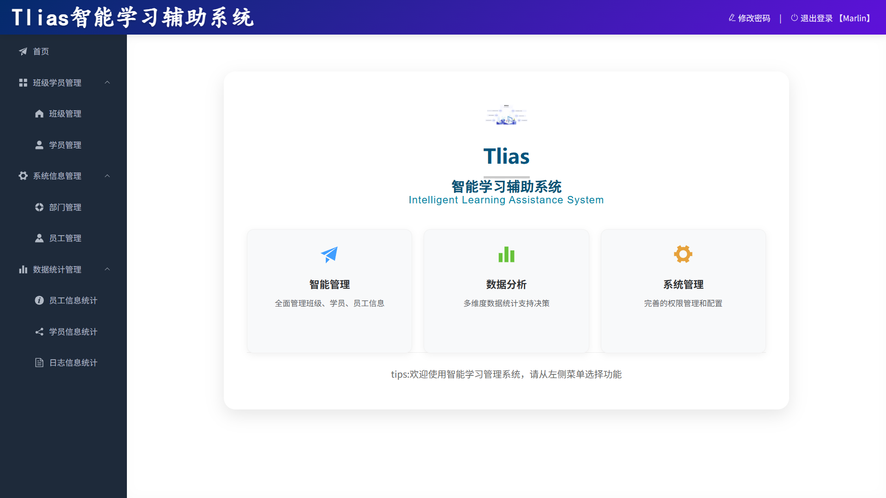

<div align="center">
  <!-- 替换为你的 Logo，如果没有可以删除或使用 Emoji -->
  

  <h1 align="center">tlias 智能学习辅助系统</h1>

  <p align="center">
    <strong>基于黑马程序员《tlias 智能学习辅助系统》的<a href="https://github.com/Marlin-Phone/SUST-Professional-Comprehensive-Design-II">专业综合设计II</a></strong>
  </p>

  <!-- 你的徽章部分 -->
  <!-- 需要将以下所有的 tlias 修改为 当前仓库 名称-->
  <p align="center">
    
    
    
     
    
    
  </p>

  <!-- 链接导航 -->
  <p align="center">
    <a href="#-功能特性">功能特性</a> • 
    <a href="#-快速开始">快速开始</a> • 
    <a href="#-技术栈">技术栈</a> • 
    <a href="#-贡献指南">贡献指南</a>
  </p>
</div>

<br/>

## 📖 项目介绍

基于黑马程序员《tlias 智能学习辅助系统》完成的 陕西科技大学 专业综合设计II 复现项目。  
适用于学生学习或尝试复现。



## ✨ 功能特性

- [x] **前后端分离**：前端使用Vue3，后端使用Spring boot，数据库使用MySQL。
- [x] **对象存储**：采用阿里云OSS进行文件存储，提升图片读取速度和可靠性。
- [x] **AOP技术**：采用面向切面编程，实现日志记录和权限控制。
- [x] **身份认证**：采用JWT进行用户身份认证和授权。
- [ ] **Docker部署**：支持Docker容器化部署，简化环境配置。
- [ ] **CI/CD**：集成GitHub Actions实现持续集成和持续部署。

## 🛠 技术栈


## 🚀 快速开始

### 依赖环境

-   JDK 17
-   Node.js v16+
-   Maven 3.8+
-   MySQL 8.0

### 配置信息

此处内容详细可见[配置说明](配置说明.md)。

### 安装步骤

```bash
# 克隆仓库
git clone https://github.com/marlin-phone/tlias.git

# 进入目录
cd tlias

# 进入前端目录
cd frontend

# 安装前端依赖
npm install

# 进入后端目录
cd ../backend

# 安装后端依赖
mvn clean install
```

### 源码运行

```bash
# 进入前端目录
cd frontend

# 运行前端项目
npm run dev

# 进入后端目录
cd ../backend

# 运行后端项目
mvn spring-boot:run
```

## 📂 目录结构

```text
├── 2025-专综II课设资料/         # 课程设计资料
├── backend/                    # 后端源码
├── frontend/                   # 前端源码
├── image/                      # 图片资源
├── 配置说明.md                  # 配置说明文档
├── init.sql                    # 数据库初始化脚本
├── LICENSE                     # 开源协议
└── README.md                   # 项目说明
```

## 🤝 贡献指南

非常欢迎你的加入！提一个 Issue 或者提交一个 Pull Request。

1. Fork 本仓库
2. 新建 Feat_xxx 分支
3. 提交代码
4. 新建 Pull Request

## 👤 作者

**Marlin Phone**

*   Github: [@marlin-phone](https://github.com/marlin-phone)

**ouvou**

*  Github: [@ouvou](https://github.com/ouvou)

## 🙏 致谢

感谢黑马程序员提供的课程与资源，感谢使用到的开源项目（前端部分：[tlias-intelligent-learning](https://github.com/ouvou/tlias-intelligent-learning)），以及参与测试与反馈的同学。

## 📄 开源协议

本项目基于 [MIT](LICENSE) 协议，详情请参阅 LICENSE 文件。